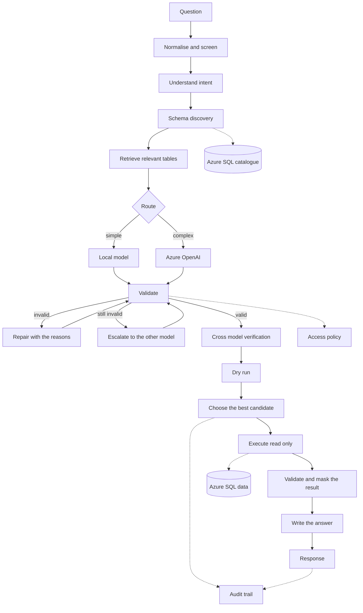

# Natural Language to SQL Assistant

An enterprise assistant that answers questions about an Azure SQL database in
plain language. It discovers the schema at runtime, generates a read only
query, proves the query is safe before anything runs, executes it under strict
limits, and explains the result.

```
"What was the total energy consumption last quarter?"
"Which facilities had the highest emissions?"
"Compare Scope 1 emissions across regions."
"Show the facilities with abnormal energy usage."
```

Nothing about the data model is built in. There is no table name, column name,
business metric or example query anywhere in the source or the prompts. The
assistant knows only what the database tells it, filtered by the access policy
in configuration.

Two models work together. A router scores each question and sends the simple
ones to a local Hugging Face model and the harder ones to Azure OpenAI. The
model that did not write the query checks it, and whichever candidate survives
validation, a dry run and that review is the one that runs.

## Contents

- [Architecture](#architecture)
- [Security model](#security-model)
- [SQL generation workflow](#sql-generation-workflow)
- [Schema retrieval](#schema-retrieval)
- [Prompt design](#prompt-design)
- [API](#api)
- [Configuration](#configuration)
- [Setup](#setup)
- [Azure SQL setup](#azure-sql-setup)
- [Azure OpenAI setup](#azure-openai-setup)
- [The local model](#the-local-model)
- [Testing](#testing)
- [Evaluation](#evaluation)
- [Docker](#docker)
- [CI and CD](#ci-and-cd)
- [Production deployment](#production-deployment)
- [Troubleshooting](#troubleshooting)

## Architecture



### The layers

| Layer | Package | What it owns |
| --- | --- | --- |
| Configuration | `nl2sql.config` | Typed settings, YAML layering, secret resolution |
| Core | `nl2sql.core` | Errors, retry policy, request context, masking |
| Database | `nl2sql.db` | Engines, Entra tokens, parameter binding, app tables |
| Metadata | `nl2sql.metadata` | Introspection, TTL cache, the policy filtered catalogue |
| Security | `nl2sql.security` | Access policy, SQL guard, tenancy, injection screening, auth |
| Models | `nl2sql.llm` | Provider interface, Azure OpenAI, local model, prompts, usage |
| Pipeline | `nl2sql.pipeline` | The stages from question to answer |
| Conversation | `nl2sql.conversation` | Optional, bounded history |
| Observability | `nl2sql.observability` | Structured logs, metrics, audit trail |
| Evaluation | `nl2sql.evaluation` | Datasets, metrics, runner, reports |
| API | `nl2sql.api` | HTTP surface, middleware, error envelope |

Every component takes its dependencies through its constructor and is built in
one place, `nl2sql.container`. That is what makes each stage testable on its
own, and what lets a test run the real pipeline with only the database and the
model endpoint replaced.

## Security model

Security here is not a filter in front of a model. It is a sequence of layers,
each of which assumes the ones before it may have failed.

### 1. The model is never told about data it may not read

The access policy is applied in the metadata service, before the catalogue
reaches anything else. A blocked table or column is not described in a prompt,
is not returned by the schema endpoint, and does not exist as far as
validation is concerned. Hiding it is cheaper and stronger than asking a model
to avoid it.

### 2. Model output is untrusted

Whatever the model returns is parsed into a syntax tree and checked. The guard
enforces:

| Threat | Control |
| --- | --- |
| Destructive statements | Only statement kinds in `security.allowed_statements` run. The default is SELECT alone, so INSERT, UPDATE, DELETE, DROP, ALTER, TRUNCATE, CREATE, MERGE and EXEC are all refused |
| Stacked statements | Anything that parses as more than one statement is refused, including a second statement hidden after a comment |
| Nested writes | A write nested inside a CTE or subquery is refused wherever it appears |
| `SELECT ... INTO` | Refused, because it creates a table |
| Data exfiltration | OPENROWSET, OPENQUERY, OPENDATASOURCE, extended procedures, linked server and cross database names are all refused |
| Catalogue probing | The `sys` and `INFORMATION_SCHEMA` schemas are refused unless explicitly enabled |
| Variables and temp tables | Refused, which removes `@@VERSION` style probing and staging tables |
| Unknown or hidden objects | Every table and column is resolved against the filtered catalogue, through scopes, so aliases, CTEs and derived tables are all checked |
| Unbounded reads | `SELECT *` is refused unless enabled; a row limit, a byte budget and a timeout are always applied |
| Query cost | Join count, cartesian joins, subquery depth and table count are capped, and on SQL Server the estimated plan cost can be checked before execution |

The refusal message never says whether an object is hidden or absent.

### 3. Injection has nowhere to land

SQL injection in the classic sense cannot occur, because no caller value is
ever placed into a statement. Tenant values and caller filters are bound as
driver parameters, and the markers used during rewriting are a reserved
pattern that model output is forbidden to contain.

Prompt injection is handled in three ways, in order of how much they are
relied on: untrusted text is placed inside delimited blocks with anything that
looks like a closing delimiter removed; the question is screened against
configurable patterns; and, most importantly, a successful injection still
produces output that must pass every check above.

### 4. Tenant isolation comes from the caller, never the question

The tenant identifier is taken from the authenticated principal. For every
table that carries a tenant column, a predicate is added to the parsed query,
in the WHERE clause for a table in FROM and in the ON clause for a joined
table, so an outer join keeps its meaning. The value is always a parameter. An
`OR 1 = 1` in the model's own WHERE is parenthesised before the predicate is
added, so it cannot widen the scope. Where the database also has row level
security, the executor sets the session context key as an independent second
layer.

### 5. Least privilege in the database

The service should hold a login that can only read. See
[Azure SQL setup](#azure-sql-setup). A live test asserts that the configured
login cannot create a table.

### 6. Nothing sensitive reaches a log

Structured logs and audit rows pass through a masker that replaces the values
of sensitive keys and rewrites credential shaped text. SQL is stored with its
literals replaced, keeping row limits readable. Principals and tenants are
stored as short hashes, questions are masked, and result rows are never
recorded.

## SQL generation workflow

Generation is not a single call. It is a sequence of cheap checks that each
catch a different kind of mistake.

| Step | Purpose | Cost |
| --- | --- | --- |
| Generate | Produce a candidate from the routed model | one call |
| Validate | Prove it is safe and every name exists | free |
| Repair | Show the model the exact reasons and ask for a correction | one call, only on failure |
| Escalate | Have the other model generate from scratch | one call, only if repair did not help |
| Verify | Have the other model judge whether the query answers the question | one call, only when confidence is low or the question is complex |
| Cross generate | Produce an alternative when the verifier disagrees | one call, only on disagreement |
| Dry run | Bind the query in the database while returning no rows | negligible |
| Select | Score the candidates and choose | free |

The final score weights validation, the dry run, the verifier's judgement and
the model's own confidence, using weights from `routing.selection_weights`.
The reported confidence combines them: agreement raises it, disagreement
lowers it in proportion to how sure the verifier was, a passing dry run raises
it slightly, and warnings lower it.

Routing scores the question before any SQL exists, from the number of tables
retrieved, the join paths between them, the intent, the time expressions, the
question length, whether it is a follow up, and how ambiguous it looked. The
weights and thresholds are configuration.

If a safe query cannot be produced, the request fails with the reasons. It
never runs something doubtful.

## Schema retrieval

Sending the whole schema to a model is expensive, buries the relevant tables
and does not fit at all on a large database. Retrieval works in four steps:

1. The question and every table are reduced to word tokens. Identifiers are
   split on case changes and underscores, so `EnergyConsumption` and
   `energy_consumption` both yield `energy` and `consumption`, and plurals are
   folded.
2. Tables are scored with BM25 over those tokens, with the table name weighted
   above column names and descriptions. A prefix pass gives partial credit, so
   `consumption` matches `consumed`.
3. The best tables are expanded along foreign keys. A question about a measure
   almost always needs the table holding the name of the thing measured, and
   that table may share no word with the question.
4. When too many candidates remain, a model narrows the list. Any name it
   returns that was not a candidate is discarded.

The resulting block lists each table with its columns, types, keys,
descriptions and the join paths available. Columns are ordered so keys and
question matches survive the per table cap, and the block says how many
columns were left out.

`retrieval.synonyms` maps question words onto the words your identifiers use.
Extending it is how you teach the retriever your domain language without
touching code.

## Prompt design

Prompts are data, in `prompts/<name>/<version>.yaml`, and never in code.

| Prompt | Purpose |
| --- | --- |
| `intent_analysis` | Classify what shape of answer the question wants |
| `table_selection` | Narrow a long candidate list |
| `sql_generation` | Produce the query and its structured metadata |
| `sql_repair` | Correct a query using the validator's own reasons |
| `sql_verification` | Judge whether a query answers the question |
| `answer_generation` | Write the answer from the result |
| `followup_rewrite` | Make a follow up question stand alone |
| `structured_output` | Carry the JSON contract for providers without native schema support |

Every prompt is versioned, and the version that produced an answer is recorded
in the audit trail. Without that, a change in answer quality after a prompt
edit is indistinguishable from a change in the model. Pin versions in
`prompts.versions` and add `v2.yaml` beside `v1.yaml` to iterate safely.

The generation contract asks for:

| Field | Meaning |
| --- | --- |
| `sql` | One SELECT statement, or empty when the question cannot be answered |
| `reasoning_summary` | One or two sentences describing what the finished query does |
| `tables_used`, `columns_used` | What the model believes it read, checked against what it actually read |
| `confidence` | A calibrated 0 to 1 estimate |
| `warnings` | Assumptions, ambiguities and missing data |

Internal chain of thought is never requested, stored or returned. The summary
describes the finished query, not the steps taken to write it.

## API

| Method | Path | Purpose |
| --- | --- | --- |
| POST | `/api/v1/query` | Answer a question |
| POST | `/api/v1/query/validate` | Produce and check a query without running it |
| GET | `/api/v1/schema` | Schemas and tables visible to the caller |
| GET | `/api/v1/schema/tables` | Columns and relationships, optionally filtered |
| POST | `/api/v1/schema/refresh` | Force rediscovery, admin role only |
| GET | `/api/v1/health` | Liveness |
| GET | `/api/v1/ready` | Readiness: database, schema and model |
| GET | `/api/v1/metrics` | Prometheus text, when enabled |

### Request

```json
{
  "question": "Which facilities had the highest emissions last quarter?",
  "user_context": { "conversation_id": "session-1042", "timezone": "Europe/Amsterdam" },
  "filters": [{ "column": "region_name", "operator": "eq", "value": "Europe" }]
}
```

Filters are applied to the columns the generated query returns, as bound
parameters. Operators are `eq`, `ne`, `gt`, `gte`, `lt`, `lte`, `in` and
`contains`.

### Response

```json
{
  "query_id": "8f14e45fceea167a5a36dedd4bea2543",
  "answer": "Ohio Plant produced the most, at 1,284 tonnes of CO2 equivalent.",
  "sql": "SELECT TOP 50 f.facility_name, SUM(m.co2e_tonnes) AS total_co2e ...",
  "columns": [{ "name": "facility_name", "type": "string" }],
  "rows": [["Ohio Plant", 1284.0]],
  "row_count": 1,
  "truncated": false,
  "execution_time": 0.042,
  "confidence": 0.91,
  "warnings": []
}
```

Routing decisions, prompt versions, token counts, schema context and stage
timings are deliberately absent. They go to the logs and the audit trail,
where operators can see them, and not to anyone who can call the API.

### Errors

```json
{
  "error": {
    "code": "sql_validation_failed",
    "message": "A safe query could not be produced: the table dbo.payroll is not available to this service.",
    "request_id": "01JBQ4Z2M8",
    "query_id": "8f14e45fceea167a5a36dedd4bea2543",
    "issues": [{ "code": "table_not_allowed", "message": "...", "severity": "error" }]
  }
}
```

Codes include `invalid_input`, `prompt_injection_detected`, `unauthenticated`,
`forbidden`, `tenant_required`, `rate_limited`, `no_relevant_tables`,
`sql_validation_failed`, `query_cost_exceeded`, `query_timeout`,
`database_unavailable` and `llm_unavailable`.

### Authentication

Send the key in the `X-API-Key` header. Keys live in the environment variable
named by `api.api_key.keys_secret` as a JSON array:

```json
[{"key_sha256": "9f86d081...", "principal": "reporting-app", "tenant_id": "acme", "roles": ["reader"]}]
```

Only the digest is stored, comparison is constant time, and the principal
carries the tenant. `auth_mode: none` exists for local work and is rejected in
production.

## Configuration

Three layers, each overriding the one before it:

1. `configs/base.yaml`, the defaults
2. `configs/<environment>.yaml`, the differences for one deployment
3. `NL2SQL_` environment variables, including anything in `.env`

Environment variables use two underscores between levels:
`NL2SQL_LIMITS__MAX_ROWS=500`, `NL2SQL_SECURITY__ALLOWED_SCHEMAS='["dbo"]'`.

| Section | What it controls |
| --- | --- |
| `database` | Azure SQL connection, authentication mode, pool, read only intent |
| `app_database` | Where audit and conversation tables live |
| `schema_cache` | Discovery TTL, views, indexes, stale behaviour, warm on startup |
| `security` | Allowed statements and schemas, blocked tables and columns, masked columns, blocked functions and keywords, injection screening |
| `limits` | Rows, execution time, result bytes, cell size, joins, subquery depth, tables, question length |
| `cost_estimation` | Plan cost ceiling on SQL Server |
| `tenancy` | Tenant column patterns, whether a tenant is required, session context key |
| `execution` | Error classification, retry policy, fetch size, dry run timeout |
| `llm` | Azure OpenAI and local model settings, provider preference |
| `routing` | Complexity weights, thresholds, repair, escalation, verification, selection weights |
| `retrieval` | Table and column caps, foreign key expansion, BM25 parameters, stopwords, synonyms |
| `intent` | Heuristic or model mode, keyword lists, time patterns |
| `prompts` | Directory, active version per prompt, untrusted delimiters |
| `answer` | Whether rows may be sent to a model, how many, decimal handling |
| `conversation` | Whether history is kept, which fields, how many turns, retention |
| `observability` | Log level and format, masking, audit, metrics endpoint |
| `api` | Authentication, CORS, body size, rate limit, docs, filter count |
| `evaluation` | Comparison tolerance, report directory |

Production fails closed: it refuses to start with `api.auth_mode: none` or an
empty `security.allowed_schemas`.

Check a configuration without connecting anywhere:

```bash
nl2sql check-config
```

## Setup

Requirements: Python 3.11 or newer, and the
[Microsoft ODBC Driver 18 for SQL Server](https://learn.microsoft.com/sql/connect/odbc/download-odbc-driver-for-sql-server)
for Azure SQL.

```bash
git clone https://github.com/Jyotisharma75/Natural-Language-to-SQL-Assistant.git
cd Natural-Language-to-SQL-Assistant

python -m venv .venv
.venv/Scripts/activate        # Windows
# source .venv/bin/activate   # macOS or Linux

pip install -e ".[dev]"        # add ,local for the Hugging Face model

cp .env.example .env           # then fill it in
alembic upgrade head           # create the audit and conversation tables
nl2sql check-config            # confirm the configuration is coherent
nl2sql serve --reload          # http://127.0.0.1:8000/docs
```

To try it without Azure, seed the demonstration schema into SQLite:

```bash
python scripts/seed_demo_database.py --url "sqlite:///./data/demo.db"
NL2SQL_DATABASE__URL="sqlite:///./data/demo.db" nl2sql ask "Which facilities used the most energy?"
```

That needs a model to be configured. Without one, `nl2sql schema` still shows
what was discovered, and `pytest` exercises the whole pipeline offline.

## Azure SQL setup

### 1. A read only login

Run this as an administrator on the database the assistant will read. It
creates a contained user that can read and nothing else.

```sql
CREATE USER nl2sql_reader WITH PASSWORD = 'a-long-random-password';
ALTER ROLE db_datareader ADD MEMBER nl2sql_reader;
DENY VIEW ANY DEFINITION TO nl2sql_reader;
```

To restrict further, grant SELECT on specific schemas instead of using
`db_datareader`:

```sql
CREATE USER nl2sql_reader WITH PASSWORD = 'a-long-random-password';
GRANT SELECT ON SCHEMA::reporting TO nl2sql_reader;
```

For managed identity, which is preferred in production because there is no
password to rotate or leak:

```sql
CREATE USER [my-container-app] FROM EXTERNAL PROVIDER;
ALTER ROLE db_datareader ADD MEMBER [my-container-app];
```

Then set `NL2SQL_DATABASE__AUTH_MODE=entra_managed_identity`.

### 2. Network access

Allow the client address on the logical server, or use a private endpoint:

```bash
az sql server firewall-rule create \
  --resource-group my-group --server my-server \
  --name allow-my-ip --start-ip-address 203.0.113.10 --end-ip-address 203.0.113.10
```

### 3. Descriptions improve results

The assistant reads table and column descriptions from extended properties and
puts them in the prompt. Adding them measurably helps a model choose between
similarly named columns:

```sql
EXEC sp_addextendedproperty 'MS_Description', 'Metered energy use per site per month',
  'SCHEMA', 'dbo', 'TABLE', 'energy_consumption';
EXEC sp_addextendedproperty 'MS_Description', 'Energy consumed in kilowatt hours',
  'SCHEMA', 'dbo', 'TABLE', 'energy_consumption', 'COLUMN', 'energy_kwh';
```

### 4. Optional row level security

With `tenancy.session_context_key` set, the executor publishes the tenant to
the session before each query, so a row level security policy can enforce
isolation in the database as well as in the query:

```sql
CREATE FUNCTION dbo.fn_tenant_predicate(@tenant_id NVARCHAR(40))
RETURNS TABLE WITH SCHEMABINDING
AS RETURN SELECT 1 AS allowed
   WHERE @tenant_id = CAST(SESSION_CONTEXT(N'tenant_id') AS NVARCHAR(40));

CREATE SECURITY POLICY dbo.tenant_filter
  ADD FILTER PREDICATE dbo.fn_tenant_predicate(tenant_id) ON dbo.facilities
  WITH (STATE = ON);
```

### 5. Point the assistant at it

```bash
NL2SQL_DATABASE__SERVER=my-server.database.windows.net
NL2SQL_DATABASE__DATABASE=my-database
NL2SQL_DATABASE__USERNAME=nl2sql_reader
NL2SQL_DB_PASSWORD=a-long-random-password
NL2SQL_SECURITY__ALLOWED_SCHEMAS=["dbo"]
```

## Azure OpenAI setup

1. Create an Azure OpenAI resource and deploy a chat model that supports
   structured output, for example a GPT-4o family deployment.
2. Note the deployment name. Azure addresses the deployment, not the model, so
   the same model can have different names in different environments.
3. Configure it:

```bash
NL2SQL_LLM__AZURE_OPENAI__ENDPOINT=https://my-resource.openai.azure.com
NL2SQL_LLM__AZURE_OPENAI__DEPLOYMENT=gpt-4o-sql
NL2SQL_LLM__AZURE_OPENAI__API_VERSION=2024-10-21
AZURE_OPENAI_API_KEY=...
```

In Azure, prefer managed identity and no key at all. Grant the identity the
`Cognitive Services OpenAI User` role on the resource, then set
`NL2SQL_LLM__AZURE_OPENAI__USE_MANAGED_IDENTITY=true`.

If your deployment expects `max_completion_tokens` or rejects a temperature,
set `llm.azure_openai.token_limit_parameter` and
`llm.azure_openai.send_temperature` accordingly. If it does not support
`json_schema` response format, set `structured_output_mode: json_object`, and
the contract moves into the system message instead.

## The local model

```bash
pip install -e ".[dev,local]"
```

The default is `Qwen/Qwen2.5-Coder-0.5B-Instruct`, chosen to run on a CPU. It
is small, so expect it to handle direct questions and to be escalated past on
harder ones, which is exactly what the router is for. Any instruction tuned
causal model works; a larger one, given a GPU, moves the useful threshold up:

```bash
NL2SQL_LLM__LOCAL__MODEL_ID=Qwen/Qwen2.5-Coder-7B-Instruct
NL2SQL_LLM__LOCAL__DEVICE=cuda
NL2SQL_LLM__LOCAL__DTYPE=bfloat16
NL2SQL_ROUTING__LOCAL_MAX_COMPLEXITY=0.6
```

Weights download on first use to `HF_HOME`. Set `llm.local.preload: true` to
load at startup rather than during the first request, and mount the cache as a
volume in a container. Generation is serialised by `llm.local.max_concurrency`,
because several generations sharing a CPU make all of them slower.

Whatever the local model produces goes through exactly the same validation as
anything else. A small model producing a bad query is a quality problem, never
a safety one.

## Testing

```bash
make check               # style, lint, format, types and the offline suite
pytest                   # the offline suite
pytest tests/security    # the attack corpus
pytest -m unit           # by marker
```

| Suite | What it covers |
| --- | --- |
| `tests/unit` | Each component in isolation, including the Azure OpenAI adapter against an injected client |
| `tests/security` | The attack corpus, tenant isolation, screening, masking, authentication |
| `tests/sql_validation` | What passes, what is rewritten and what is refused |
| `tests/integration` | The whole pipeline over a real SQLite database |
| `tests/api` | The HTTP contract, including what must be absent from a response |
| `tests/evaluation` | The metrics and the runner |
| `tests/live` | Real Azure SQL, real Azure OpenAI and the real local model |

Azure OpenAI is never called in the offline suite: `ScriptedProvider`
implements the real provider interface and returns prepared answers, so the
pipeline under test is the production pipeline. The database is real in every
suite, through `TestDatabase`, which builds a schema from a specification on
any SQLAlchemy URL. Nothing in `src` knows the test tables exist; they are
discovered by the same introspection that runs against Azure SQL.

The live tests skip unless their resource is configured:

```bash
pytest tests/live -m live_azure_sql
pytest tests/live -m live_azure_openai
NL2SQL_RUN_LOCAL_MODEL_TESTS=1 pytest tests/live -m local_model
```

## Evaluation

A dataset states what a correct answer looks like from several angles, because
no single angle is enough:

```json
{
  "id": "emissions-highest-facilities",
  "question": "Which facilities had the highest emissions?",
  "expected_tables": ["emissions", "facilities"],
  "expected_columns": ["co2e_tonnes", "facility_name"],
  "reference_sql": "SELECT TOP 10 f.facility_name, SUM(m.co2e_tonnes) AS total ...",
  "reference_dialect": "tsql",
  "expected_result": {"non_empty": true, "max_rows": 10, "ordered_by": "total", "descending": true}
}
```

```bash
python scripts/run_evaluation.py --dataset evaluation/datasets/sustainability_demo.jsonl
```

Measured per case:

| Measure | How |
| --- | --- |
| SQL validity | The validator accepted the generated query |
| Execution success | It ran against the database |
| Table and column overlap | Precision, recall and F1 against the expected sets |
| Semantic equivalence | The generated and reference statements match once normalised |
| Result correctness | The two result sets carry the same values, order insensitively, within a tolerance |
| Result characteristics | Row counts, expected columns and ordering |
| Latency | Per case, reported as mean, p50 and p95 |

The reference query runs through the same validator and executor as a
generated one, because a dataset is a file on disk and is not automatically
more trustworthy than model output.

A case that could not be judged, for example because its reference query could
not run, is reported as not scored rather than counted as a pass. This
repository contains no accuracy figures, because accuracy depends on your
schema, your data and your deployment. Run the suite and read the report.

## Docker

```bash
make docker-build
make docker-up          # API plus SQL Server for local development
```

The image is a multi stage build: a builder installs into a virtual
environment that is copied whole into a slim runtime, with the Microsoft ODBC
driver present at both stages. It runs as an unprivileged user, has a liveness
health check, and does not run migrations on start, because a container that
migrates on start races every other replica during a rolling deploy.

Build with the local model included only if you want it:

```bash
docker build -f docker/Dockerfile --build-arg EXTRAS=local -t nl2sql-assistant .
```

## CI and CD

`ci.yml` runs on every push and pull request:

| Job | What it proves |
| --- | --- |
| quality | House style, lint, formatting and strict types |
| test | The offline suite on Python 3.11, 3.12 and 3.13, with coverage |
| sqlserver | Discovery, validation and execution against a real SQL Server container, which is the only way to test the T-SQL path |
| migrations | Migrations apply, reverse and match the models |
| container | The image builds and the application serves inside it |
| security | Dependency audit and a source scan, advisory |

`cd.yml` runs on a version tag or on demand: it builds and pushes to Azure
Container Registry using federated credentials, applies migrations as a
separate job before the new revision is deployed, updates the container app,
waits for health, and shifts traffic back to the previous revision on failure.

Required repository configuration: secrets `AZURE_CLIENT_ID`,
`AZURE_TENANT_ID`, `AZURE_SUBSCRIPTION_ID`, `ACR_NAME` and
`NL2SQL_APP_DATABASE_URL`, and variables `CONTAINER_APP_NAME`,
`RESOURCE_GROUP` and `NL2SQL_ALLOWED_SCHEMAS`.

## Production deployment

A checklist worth following before the first real deployment:

- [ ] `NL2SQL_ENV=production`, which refuses open authentication and an empty
      schema allowlist
- [ ] The database login holds read permission only, and nothing else
- [ ] `security.allowed_schemas` names exactly the schemas that should be
      answerable
- [ ] `security.blocked_columns` covers anything sensitive that lives in an
      answerable schema
- [ ] Managed identity for both Azure SQL and Azure OpenAI, so there is no key
      to rotate
- [ ] API keys stored as digests, delivered through Key Vault references
- [ ] `limits` reviewed against what your database can absorb, and
      `cost_estimation.enabled` switched on
- [ ] `tenancy` configured if your data is multi tenant, with row level
      security in the database as the second layer
- [ ] `app_database.url_secret` pointing at a durable database, not SQLite, so
      the audit trail survives a restart
- [ ] Migrations applied as a job before the new revision goes live
- [ ] Logs shipped somewhere queryable, and the metrics endpoint scraped
- [ ] `/api/v1/ready` used as the readiness probe and `/api/v1/health` as the
      liveness probe

Sizing: the service is IO bound waiting on the model and the database, so
replicas are cheap unless the local model is enabled, in which case each
replica needs memory for the weights and a CPU it is not sharing.

## Troubleshooting

**No tables were discovered.** The login cannot see them, or
`security.allowed_schemas` does not include them. Check with
`nl2sql schema`, then confirm the grants with
`SELECT * FROM sys.database_permissions`.

**`Data source name not found` or `Can't open lib 'ODBC Driver 18'`.** The
ODBC driver is not installed. Install the Microsoft ODBC Driver 18, or set
`NL2SQL_DATABASE__DRIVER` to a driver that is present. `odbcinst -q -d` on
Linux and macOS, and the ODBC Data Source Administrator on Windows, list what
you have.

**`Login failed` with a correct password.** Check that the firewall allows
your address, and that the user is a contained database user on the database
rather than a server login.

**Every question is refused with `no_relevant_tables`.** Retrieval found no
overlap between the question and your identifiers. Add domain vocabulary to
`retrieval.synonyms`, add descriptions to your tables, and confirm the tables
are visible.

**Queries fail validation with `column_not_allowed`.** The model invented a
column, or the real one is blocked. The `/api/v1/query/validate` endpoint
returns the specific issues. Check `security.blocked_columns` for a pattern
that is broader than you intended.

**`query_timeout` on a query that should be quick.** The generated query is
probably scanning. Enable `cost_estimation`, lower `limits.max_execution_seconds`
so it fails fast, and consider indexes on the columns the questions filter on.

**`llm_unavailable`.** Neither model is usable. `nl2sql check-config` prints
which providers are configured and which are usable; `/api/v1/ready` reports
the same at runtime.

**The local model is slow.** A CPU generation of a few hundred tokens takes
seconds. Lower `llm.local.max_new_tokens`, set `llm.local.preload: true`, or
lower `routing.local_max_complexity` so fewer questions route to it.

**Answers ignore the previous question.** Conversation history is disabled, or
no `conversation_id` was sent, or `conversation.stored_fields` does not include
enough to resolve a reference.

**The audit trail is empty.** `observability.audit_enabled` is false, or
`app_database` points somewhere that was never migrated. Run
`alembic upgrade head`.
